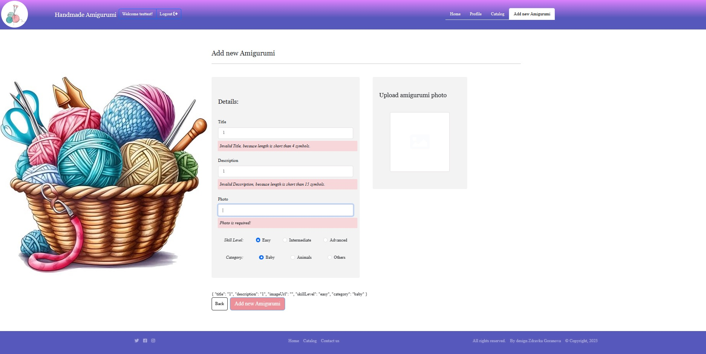

# Angular-Project-Amigurumi

# My-React-Prodject-2023

"Amigurumi" is a place, where you can browse some of the most popul aramirurumi  product in the world and add some new product that you have created. Authenticated users can like and comment on products in the app. Sellers can use the platform to add, update and delete products from their profile page.

The  "Amigurumi"  application contains the following views: login page, registration page, logout page, personal profile page, catalog page and details page.

The front end of the project has been deploy in Firebase:   https://amugurumiusers.web.app

## Short description
 - This project was bootstrapped with [Angular]...).
 - Single Page App (SPA) - Angular.
 
 ## Usage
- npm i
- ng s
- email - testtest@gmail.com
- password - 123456
 
## Languages and libraries used
 - Angular
 - Javascript
 - HTML/CSS
 - Bootstrap
 - Firebase
 
 ## Architecture - the project is structured
 - `src` folder contains the whole project.
 - `public` folder contains global asssets for the app(including the json file for simulating Web API calls).
 - `src` folder contains the app, index.html, styles.css, environments and folders for the components, modules, app.interceptor.ts,routing.module and service.
 - `components` folder - properly named folder for each component that includes the component itself, the css  for the component).
 - `app` folder - contains c...
 - `core` folder - contains c...
 - `product` folder - contains c...
 - `shared` folder - contains c...
 - `types` folder - contains c...
 - `user` folder - contains c...
 
 
# Routes views

## Home Page

## Register Page

## Login Page 

## Profile Page

## Catalog Guest Page

## Catalog Profile Page

## Create  Page and Validation

## Edit Page

## Delete Product

## Owner Details Page

## Details Comment Page.jpg

## Details Page Comment

## Details Page Add Comment

## Details Page Like Product

## PageNotFound

