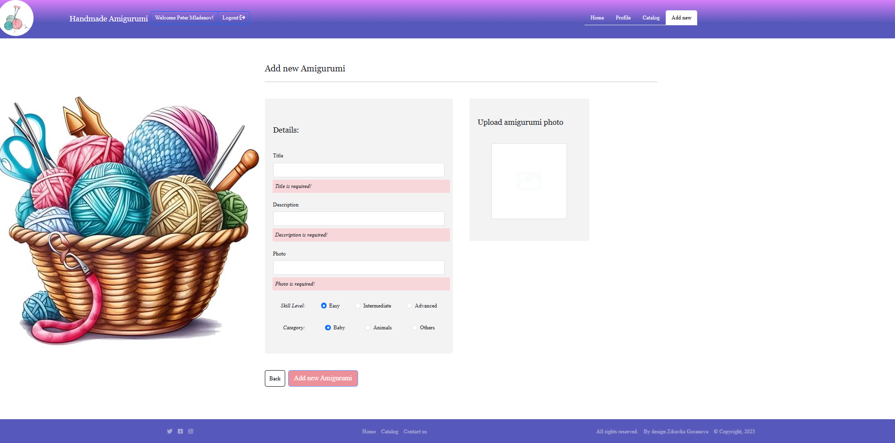

#  Angular-Project-Amigurumi

"Angular-Project-Amigurumi" is a place, where you can browse some of the most popular Amigurumi  in the world and add some new product that you have created. Authenticated users can like and comment on products in the app. Sellers can use the platform to add, update and delete products from their profile page.

The  "Angular-Project-Amigurumi"  application contains the following views: login page, registration page, logout page, personal profile page, catalog page and details page.

The front end of the project has been deploy in Firebase: [ https://amugurumiusers.web.app](https://amugurumiusers.firebaseapp.com/)

 ## Documentation:

- This is Single Page Application built with <strong>Angular, Bootstrap, HTML/CSS, Javascript</strong>
- This project was bootstrapped with [Angular](https://github.com/facebook/angular)
  
### Installation:
1. Clone this repository `git clone https://github.com/ZdravkaGoranova/Angular-Project-Amigurumi.git`
2. Go to folder src: `cd src`
3. Install dependencies: `npm install`
4. Make sure you created <strong>.env</strong> file in the main directory and populate it with correct variables
5. Start the application: `npm start`

 ### Test Accounts:
`Account with data:` - email : `peter@abv.bg` password : `123456`

### Error Handling:

- If there is an error it is returned as { message }

- Example: {message: "Invalid Password, because length is short than 6 symbols." }

### Run Web UI Tests:
-  `npm start`
- Go to folder tests: `cd tests`
- `npx playwright test test`
  
 
  
### It has:
- Two types of users: <strong>Guest User</strong> and <strong>Logged-In User</strong>
- One types of login:  <strong>Login with correct details after registration</strong>
- Web Responsive Design
- Route Guards
- Web UI Tests made with playwright/test Library
- Form Validations
- Loading Spinner
- Displays errors from back-end
  

 ## Architecture /  Folder Structure
 
 - `public` folder contains global asssets for the app.
 - `src` folder contains the app, index.html, styles.css, environments and folders for the components, modules, app.interceptor.ts,routing.module and service.
 - `src/app` folder - properly named folder for each component that includes the component itself, the css  for the component.
 - `src/environments` folder - contains custom environments
 - `src/app/core` folder - contains footer,header and error components.
  - `src/app/guards` folder -  contains authguards.
 - `src/app/home` folder - contains css, html and ts components.
 - `src/app/main` folder -  contains </app-product-list>.
 - `src/app/product` folder - contains details,edit, new-product components,product-routing,product.module.
 - `src/app/product-list` folder - contains css, html and ts components.
 - `src/app/shared` folder - contains loader, pipes and validators.
 - `src/app/user` folder - contains login,register and profile components.
   
 ### Routes:

Here are the available routes:

- `/` : homepage which redirects to `/login`
- `/auth/login` : displays login form
- `/auth/register` : displays register form
- `/catalog/products` : displays all products
- `/catalog/products/:id` : displays a product
- `/catalog/products/edit/tdTq8ZOD4vFEcgmJBEx7`: displays a  product details for edit from author
- `/auth/profile` : displays user's profile details
- `/catalog/addNewProduct` : displays user's individual new  product details

  
 ## Routes views:

 ###  Home Page:

 ### Register Page:

## Register  Page and Validation:

###  Login Page:

###  Login  Page and Validation:

###  Profile Page:

###  Catalog  Page:

###  Create  Page and Validation:

###  Edit Page:

###  Delete Product:

###  Owner Details Page:

###  Details Page Comment:

###  Details Page Add Comment:

### PageNotFound:

###  Delete Product:

###  Development server

Run `ng serve` for a dev server. Navigate to `http://localhost:4200/`. The application will automatically reload if you change any of the source files.

## Code scaffolding

Run `ng generate component component-name` to generate a new component. You can also use `ng generate directive|pipe|service|class|guard|interface|enum|module`.

## Build

Run `ng build` to build the project. The build artifacts will be stored in the `dist/` directory.

## Running unit tests

Run `ng test` to execute the unit tests via [Karma](https://karma-runner.github.io).

## Running end-to-end tests

Run `ng e2e` to execute the end-to-end tests via a platform of your choice. To use this command, you need to first add a package that implements end-to-end testing capabilities.

## Further help

To get more help on the Angular CLI use `ng help` or go check out the [Angular CLI Overview and Command Reference](https://angular.io/cli) page.
